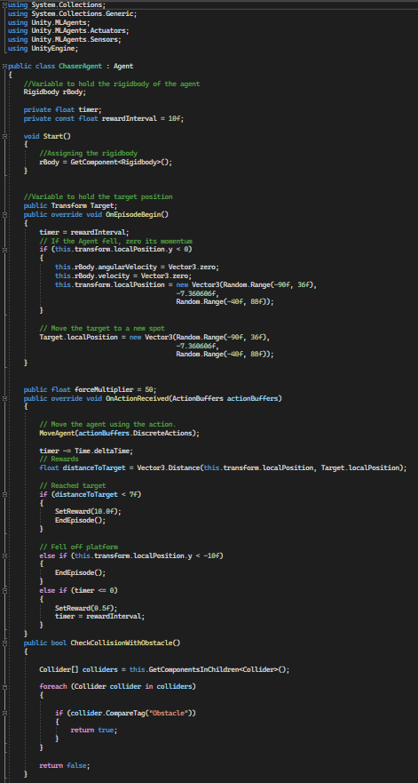
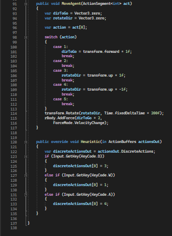
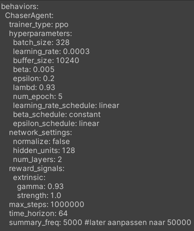
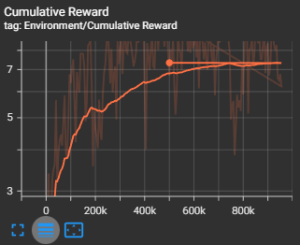

# ML-Agents: Attempt 2

This README explains the functionality of the first attempt at implementing ML-Agents but later transitioning to Marius' implementation due to its superior performance.

## ChaserAgent.cs

This code accounts for obstacles by adding rewards and punishments where needed.

## ChaserAgent.yaml

## Tensorboard

This implementation does work, its just that its currently not the very best.
Here you will find the tensorboard result.

