# ML-Agents: Attempt 3

## ChaseAgent.cs

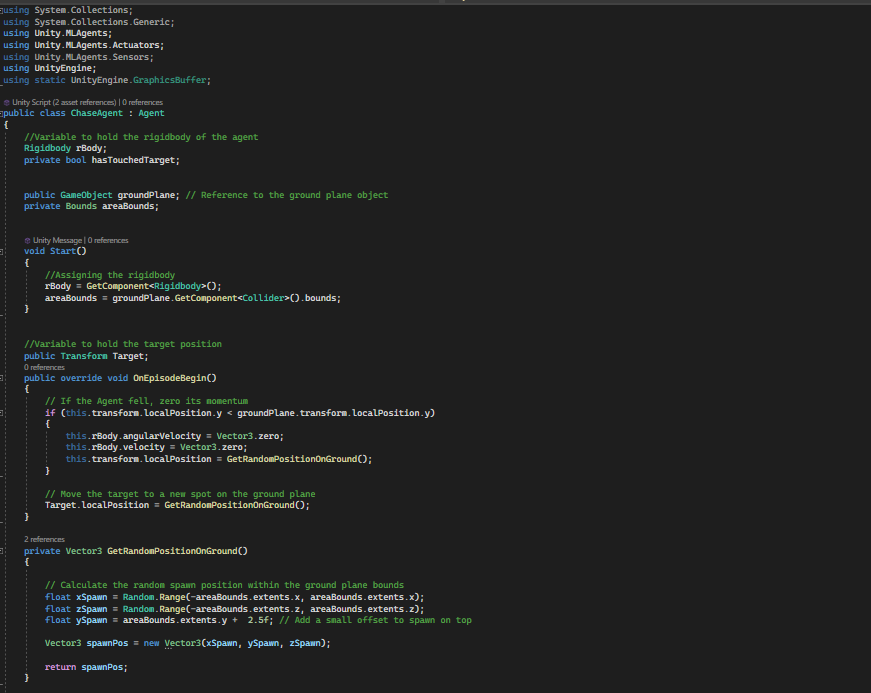
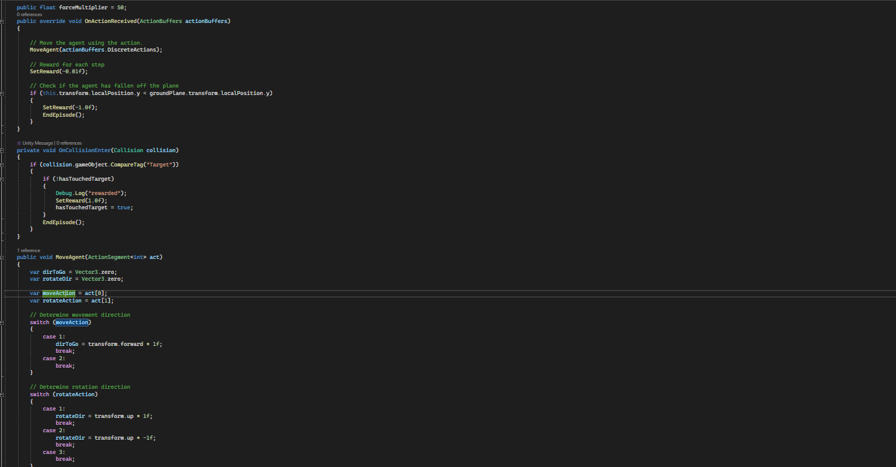
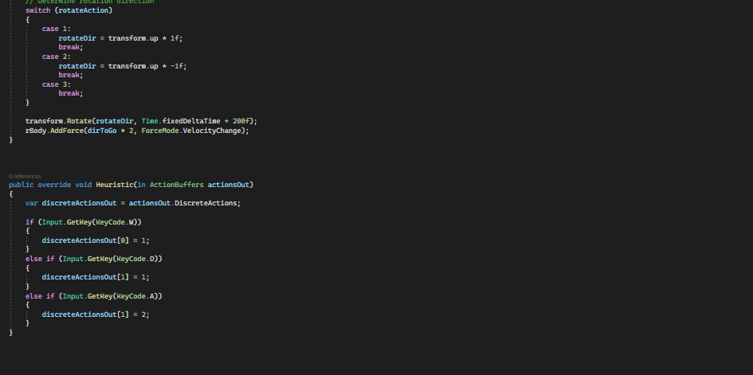

## ChasePlayer-256u.yaml

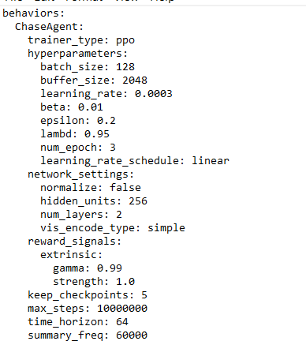

## ChaseAgent2.cs

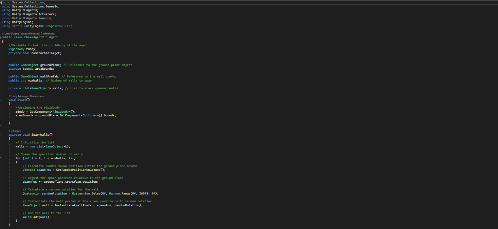
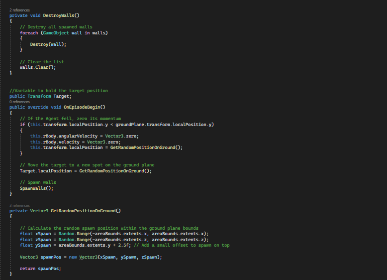

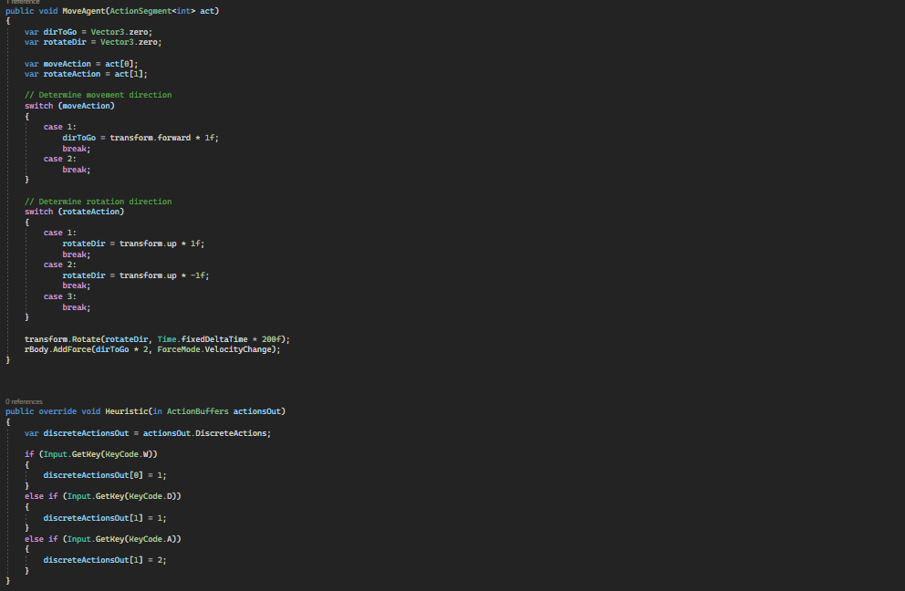

## ChasePlayer-325u.yaml

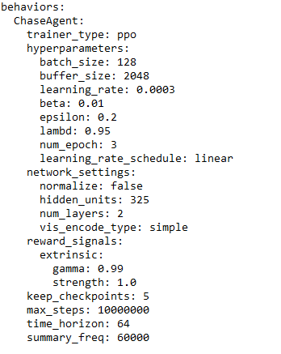

## ChaseAgentCollab.cs

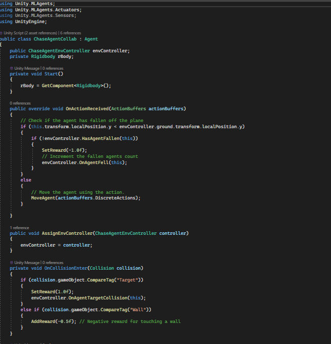
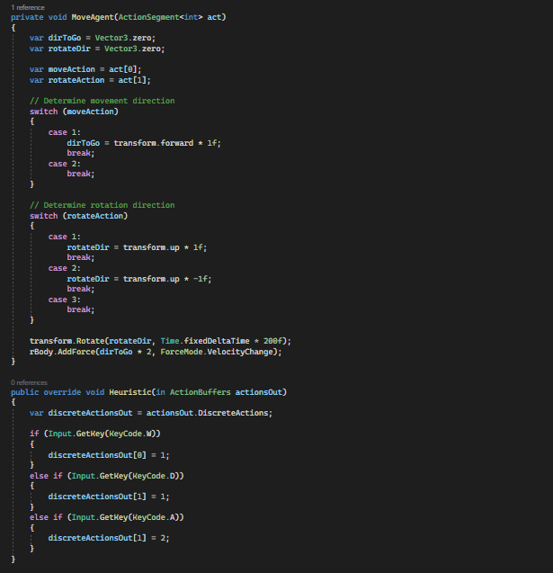

## ChasePlayerCollab-325u.yaml

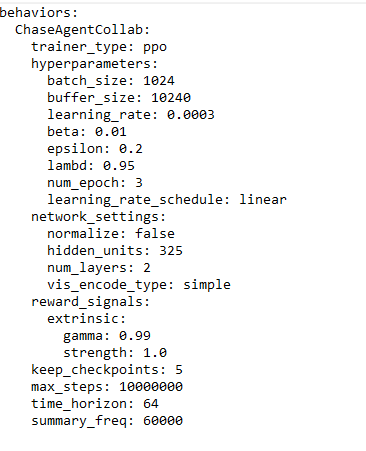

## ChaseAgentEnvController.cs

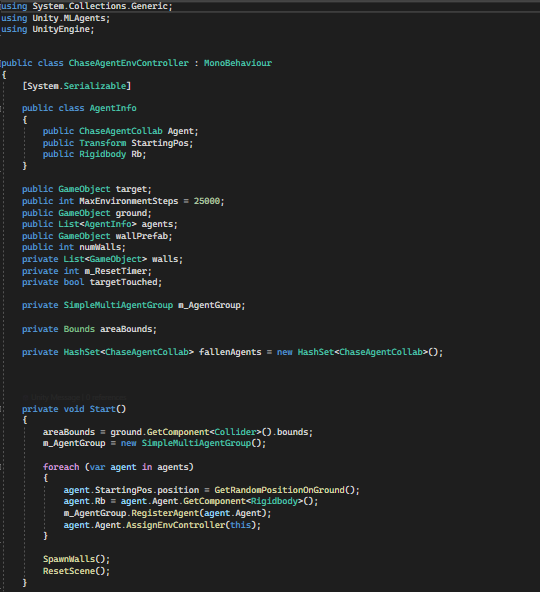
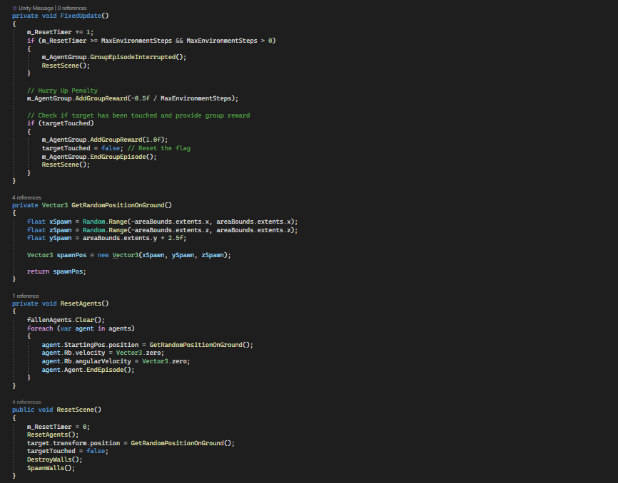

## Tensorboard

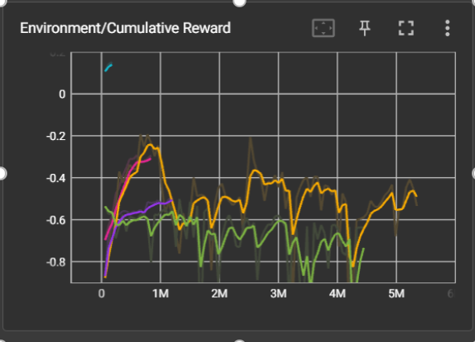#
