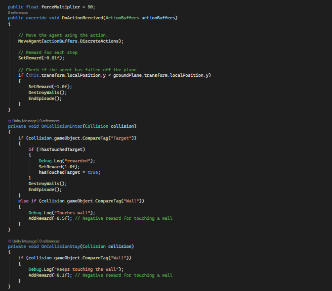

# ML-Agents: Attempt 3

## ChaseAgent.cs

## ChasePlayer-256u.yaml

## ChaseAgent2.cs

## ChasePlayer-325u.yaml

## ChaseAgentCollab.cs

## ChasePlayerCollab-325u.yaml

## ChaseAgentEnvController.cs

## Tensorboard

#
