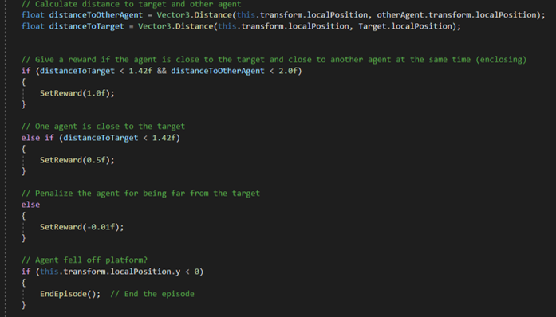

# ML-Agents: Attempt 1

This README will explain the functionality of how the first attempt at ML_Agents functionality was tried.

## AgentScript.cs

### Awake + Initialize + OnEpisodeBegin:

- Awake gets the AgentRigidbody.
- Initialize identifies the target through a tag.
- OnEpisodeBegin resets the agent when he falls off platform. He puts the agent on a random location on the platform.

### CollectObservations:

We collect these observations:

- The agent's own position
- The agent's velocity
- The agent's distance to the target
- The position of the second agent

### OnActionReceived:

The OnActionReceived method receives two discrete actions from the agent. moveX (x-axis) and moveZ (z-axis), and maps them to specific forces to apply to the agent's rigidbody.

The two switch statements in the code map the discrete actions to specific forces to apply to the addForce vector. For example, if moveX is 1, the addForce.x value will be set to -1, which will move the agent to the left.

In summary, the first part of the OnActionReceived method receives actions from the agent and maps them to specific forces to move the agent in the scene.

Aside from that the OnActionReceived method also calculates the distance between him, the target and the second agent.

Rewards:

- +1: When the agent is close to the target and the second agent. This to endore closing in on the target.
- +0.5: When the agent is only close to the target.
- -0.01: When the agent is far from the target. Small negative reward to encourage agent to move towards target but not catch it immediately.

A final thing OnActionReceived also takes care off is, if the agent falls of the platform then the episode will end.

### OnTriggerEnter:

An OnTriggerEnter is used for being able to know when the agent catches the target. When the OnTriggerEnter triggers the code will check which agent catched the target, it will reward that agent accordingly. It will also check the current distances between target - agent and agent1 - agent2.

Rewards:

- +1: The agent that catches the target.
- +0.1: For both agents when one catches the target and both were close to it. (To endorse working together with closing in)

## TargetCatchingEnvironment.cs

### Start

The start method registers the:

- Target
- Agents

It also puts the agents in a SimpleMultiAgentGroup.

### OnTriggerEnter

The OnTriggerEnter method checks when the target is caught. It gives a groupreward of one to the SimpleMultiAgentGroup. Afterwards it ends the group episode and resets the scene.

### ResetScene

The ResetScene method resets the agents and target to the startpositions and their startrotations. Because the code didn't work the functionality of resetting the scene with random positions wasn't implemented.

## Config file for ML_Agents

### AgentScript.yaml

The config file is made for two agents. It used the ppo trainer type.

## Scene setup

