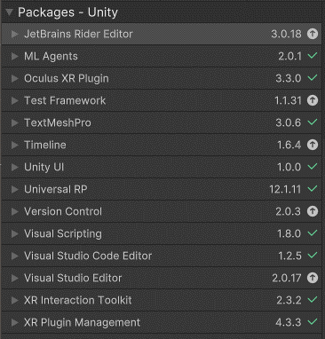
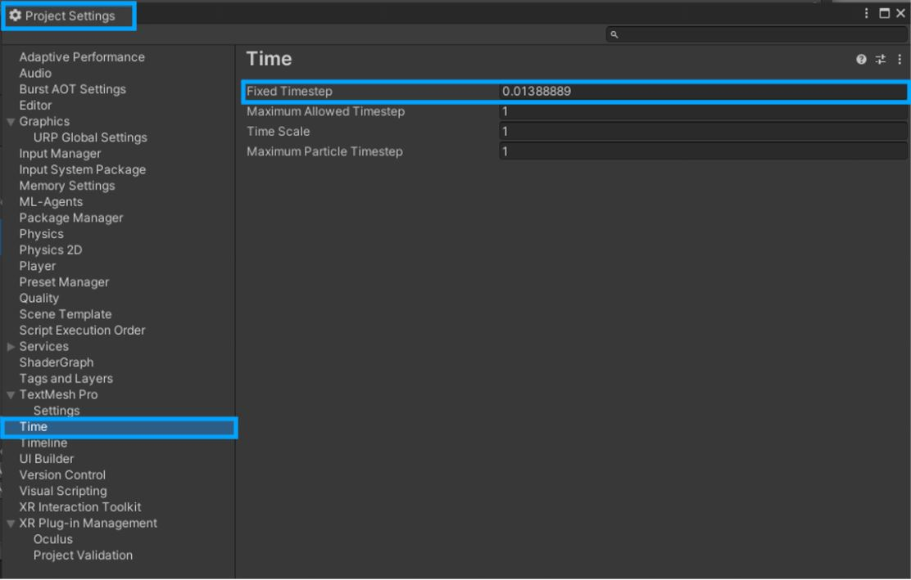

# 1. Initialisation project

Unity version: 2021.3.23f1

---

When we tried to work with the ML-Agents plugin for unity we came accross many issues when starting from the VR room unity project. Thus we will initialise this github repository by all pulling the base project and installing the ML-Agents and VR plugins on our devices before doing a push.

#### Step plan for initialising this project:

\
**Note: If errors are present it might be because you need to restart the unity editor.**

1. You have to add these packages (read the notes below the image first):

\
Notes:

- With the Oculus XR Plugin package you might get a pop-up asking to activate the native backends. Press Yes
- With the XR Interaction Toolkit package you might get a pop-up on which the message itself explains that you have to press no. (For newly installed projects press no)
- XR Plugin Management may be installed but not show up in the "in project tab". It should show it's installed in the unity registry though. This is due to the Oculus XR Plugin, this plugin has a depency on it and will install it if it's not avaible yet.

2. In Edit/ProjectSettings -> XR Plug-in Management: Make sure Oculus is slected. Otherwise it won't work with the Meta Quest 2.

3. In Edit/ProjectSettings -> XR Plug-in Management -> Oculus: Make sure you select low overhead mode.

4. In Edit/ProjectSettings -> Player -> Rendering: Make sure to put color space on linear, select multithreaded rendering and put texture compression format on ASTC.

5. In Edit/ProjectSettings -> Player -> Identification: Put the minimum API Level on at least android 6.0 . This is the minimum requerement for the Meta Quest 2.

6. In Edit/ProjectSettings -> Player -> Configuration: Make sure that you put the scripting backend on IL2CPP (this allows you to use ARM64). Put the target architecture on ARM64 and put the install location on automatic. Putting it on automatic lets you ptu your builds directly on your VR-Headset.

7. In Edit/ProjectSettings -> Quality: Make a new quality level with a name of your choice. For example: Standalone VR. Use the arrows at Default to select this level as default for android. Lower de pixel count to 1. Up the Anti Aliasing to 4x multi sampling and make sure Vsync is turned off. Also deselect soft particles if selected.

8. In Edit/ProjectSettings -> Time: Put the fixed timestep on 1/72.

