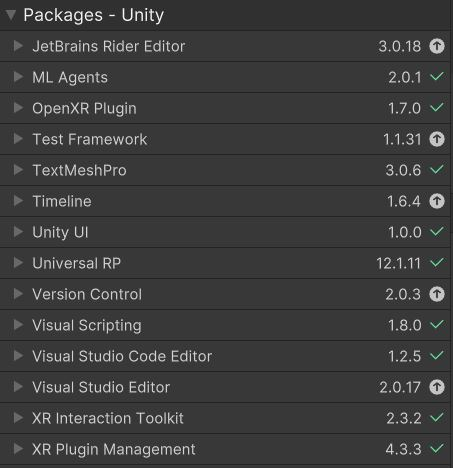
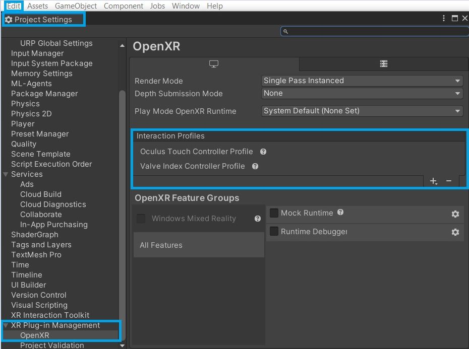

# 1. Initialisation project

Unity version: 2021.3.23f1

---

When we tried to work with the ML-Agents plugin for unity we came accross many issues when starting from the VR room unity project. Thus we will initialise this github repository by all pulling the base project and installing the ML-Agents and VR plugins on our devices before doing a push.

#### Step plan for initialising this project:

1. You have to add these packages (read the notes below the image first):

\
Notes:

- With the OpenXR Plugin package you might get a pop-up asking to activate the native backends. Press Yes
- With the XR Interaction Toolkit package you might get a pop-up on which the message itself explains that you have to press no. (For newly installed projects press no)
- XR Plugin Management may be installed but not show up in the "in project tab". It should show it's installed in the unity registry though.

2. Make sure that in Edit/ProjectSettings -> XR Plug-in Management -> OpenXR that in the Interaction Profiles the ones in the image are selected.

3. If errors are present it might be because you need to restart the unity editor.
