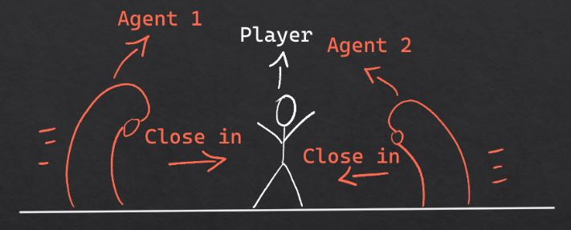

# 2. ML-Agents documentation

## A. Goal ML-Agents

The agents need to be able:

- To find the player and try to catch him.
  \
   _Meaning: The agent needs to be able to navigate through the environment and its obstacles. While doing this he needs to find the player and catch him._
- To surround the player as a group with the second agent.
  \
  _Meaning: The agent needs to work together with a second agent to close in on the player at the same time._

  

## B. Documentation attempts

For ML_Agents we attempted several times to get it working. This section is to redirect to the attempt you want to view. Each redirects to the folder where the agent code is found in.

Reinforcement learning:

[1. Attempt 1 (failed)](https://github.com/AP-IT-GH/eindproject-Studentaccount456/tree/NewMain/Assets/ID_004/Scripts/Final_Project)
\
[2. Attempt 2 (Not good enough)](https://github.com/AP-IT-GH/eindproject-Studentaccount456/tree/NewMain/Assets/ID_002/Scripts)
\
[3. Attempt 3 (final attempt => most complete)](https://github.com/AP-IT-GH/eindproject-Studentaccount456/Assets/ID_003/Scripts)
