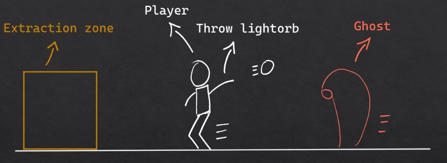

# VR_Experience End Project

## Project name: Chased

Group members:

- Boukhada Youssef (yousef12333)
- Cuypers Jan (Studentaccount456)
- Stoica Marius (MariusSpaceEngineer)
- Van Loon Joppe (Joppe-vL)

### 1. Project description

The player gets chased by ghosts. He can fend these off with light orbs.

The lightorbs are scattered around the map. The player also attains light orbs automatically in his inventory. This happens through timed intervals. For example after every 30 seconds. The feature for attaining lightorbs after time intervals has not been implented in this project due to time constraints.

The goal of the game is to get to the extraction zone.

The project uses unity version: 2021.3.23f1

### 2. Documentation

[0. Documentation page](https://github.com/AP-IT-GH/eindproject-Studentaccount456/tree/NewMain/Documentation)
\
[1. Initialisation](https://github.com/AP-IT-GH/eindproject-Studentaccount456/tree/NewMain/Documentation/1.%20Initialisation)
\
[2. ML_Agents Chased documentation page](https://github.com/AP-IT-GH/eindproject-Studentaccount456/tree/NewMain/Documentation/2.%20ML_Agents)
\
[3. VR-Environment](https://github.com/AP-IT-GH/eindproject-Studentaccount456/tree/NewMain/Documentation/3.%20VR_Environment)
\
[4. Presentation](https://github.com/AP-IT-GH/eindproject-Studentaccount456/tree/NewMain/Documentation/3.%20VR_Environment)
